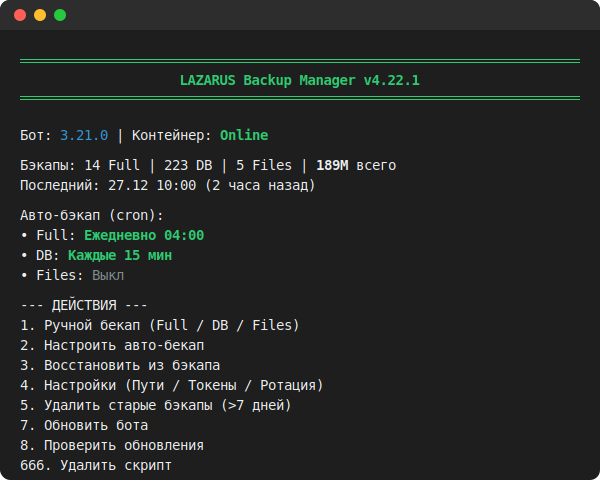

<p align="center">
  
</p>

# LAZARUS Backup Manager

[](https://www.gnu.org/software/bash/)
[](LICENSE)
[](https://github.com/UnderGut/LAZARUS-Backup-Manager/releases)
[](https://docs.docker.com/compose/)

**LAZARUS** — продвинутая система резервного копирования для **Remnawave Telegram Shop Bot** с поддержкой шифрования, облачных хранилищ и умной автоматизацией.

---

## Быстрый старт

Одна команда — установка и запуск:

```bash
bash <(curl -sSL https://raw.githubusercontent.com/UnderGut/LAZARUS-Backup-Manager/main/lazarus-backup)
```

Или установить в систему:

```bash
curl -sSL https://raw.githubusercontent.com/UnderGut/LAZARUS-Backup-Manager/main/lazarus-backup -o /usr/local/bin/lazarus && chmod +x /usr/local/bin/lazarus && lazarus
```

---

## Возможности

- **Smart Scan** — автоматически находит бота в Docker
- **3 типа бэкапов** — Full (БД + файлы), DB Only, Files Only
- **AES-256 шифрование** — защита архивов паролем
- **Telegram** — отправка файлов и уведомлений (раздельно настраивается)
- **FTP / FTPS / WebDAV / Rclone** — облачные хранилища с retry и пошаговой настройкой
- **Cron автоматизация** — настройка расписания из меню
- **Умная ротация** — по времени или количеству
- **Восстановление** — Full / DB / Files из любого бэкапа
- **Авто-обновление** — проверка и установка новых версий из меню
- **Режим отладки** — флаг `--debug` для детального логирования

---

## Требования

- Linux (Debian/Ubuntu/CentOS)
- Bash 5+, root права
- Docker Compose v2
- tar, gzip, curl, openssl

---

## Главное меню

```
LAZARUS Backup Manager v4.16.0
Бот: 3.21.0 | Контейнер: Online

Бэкапы: 14 Full | 223 DB | 5 Files | 189M
Последний: 27.12 10:00 (2 часа назад)

Авто-бэкап:
 * Full:  Ежедневно 04:00
 * DB:    Каждые 15 мин
 * Files: Выкл

1. Ручной бекап
2. Настроить авто-бекап
3. Восстановить из бэкапа
4. Настройки
5. Удалить старые бэкапы
8. Проверить обновления
666. Удалить скрипт
0. Выход
```

---

## Настройки (config.env)

Конфигурация: `/opt/lazarus-backup/config.env` (chmod 600)

### Telegram

| Параметр | Описание | Пример |
|----------|----------|--------|
| `BOT_TOKEN` | Токен Telegram бота | `123456:ABC-DEF1234...` |
| `CHAT_ID` | ID чата для уведомлений | `-1001234567890` |
| `TG_MESSAGE_THREAD_ID` | ID топика (для групп с темами) | `12345` или пусто |
| `SEND_TO_TELEGRAM` | Уведомления в TG | `true` / `false` |
| `TG_SEND_FILE` | Отправлять архив в TG | `true` / `false` |

### Бот и Docker

| Параметр | Описание | Пример |
|----------|----------|--------|
| `BOT_PATH` | Путь к docker-compose бота | `/root/remnawave` |
| `BOT_CONTAINER_NAME` | Имя контейнера бота | `remnawave-telegram-shop-bot` |
| `DB_CONTAINER_NAME` | Имя контейнера БД | `remnawave-telegram-shop-db` |
| `DB_USER` | Пользователь PostgreSQL | `postgres` |
| `IGNORE_MISMATCH` | Игнорировать несоответствие контейнера | `true` / `false` |

### Ротация бэкапов

| Параметр | Описание | Пример |
|----------|----------|--------|
| `DELETE_MODE` | Режим удаления | `time` (по дням) / `count` (по количеству) |
| `RETENTION_DAYS` | Хранить N дней (если mode=time) | `7` |
| `MAX_BACKUPS_COUNT` | Макс. количество (если mode=count) | `100` |

### Расписание (cron формат)

| Параметр | Описание | Пример |
|----------|----------|--------|
| `SCHEDULE_FULL` | Расписание полного бэкапа | `0 4 * * *` (ежедневно 04:00) |
| `SCHEDULE_DB` | Расписание бэкапа БД | `*/15 * * * *` (каждые 15 мин) |
| `SCHEDULE_FILES` | Расписание бэкапа файлов | пусто (отключено) |

### Удалённое хранилище

| Параметр | Описание | Пример |
|----------|----------|--------|
| `REMOTE_STORAGE_TYPE` | Тип хранилища | `off` / `ftp` / `ftps` / `webdav` / `rclone` |
| `REMOTE_STORAGE_URL` | URL сервера с папкой | `ftp://backup.server.com/backups/` |
| `REMOTE_STORAGE_USER` | Логин | `backup_user` |
| `REMOTE_STORAGE_PASS` | Пароль | `secret123` |
| `SEND_TO_REMOTE` | Отправлять на удалённый сервер | `true` / `false` |

### Шифрование и фильтрация

| Параметр | Описание | Пример |
|----------|----------|--------|
| `BACKUP_PASSWORD` | Пароль AES-256 шифрования | `MySecretPass123` или пусто |
| `MAX_FILE_SIZE_MB` | Макс. размер файла в архиве (MB) | `1` (пропуск больших) |
| `EXCLUDE_DIRS` | Исключить папки (через пробел) | `node_modules .git cache` |

---

## CLI команды

```bash
lazarus                  # Меню
lazarus backup_full      # Полный бэкап
lazarus backup_db        # Только БД
lazarus backup_files     # Только файлы
lazarus cleanup          # Очистка
lazarus restore          # Восстановление
```

### Флаги

| Флаг | Описание |
|------|----------|
| `--yes`, `-y` | Автоподтверждение |
| `--dry-run`, `-n` | Предпросмотр |
| `--debug`, `-d` | Режим отладки |
| `--report-tg` | Отчёт в Telegram |

---

## Удалённые хранилища

**FTP/FTPS:**
```
ftp://backup.example.com/backups
ftps://secure.example.com:990/folder
```

**WebDAV:**
```
https://webdav.yandex.ru/backups
https://cloud.example.com/remote.php/dav/files/user/
```

**Rclone:**
```
gdrive:backups
s3:bucket/backups
```

---

## Структура файлов

```
/opt/lazarus-backup/
├── config.env          # Конфигурация
├── backup/             # Архивы
/usr/local/bin/lazarus  # Скрипт
/var/log/lazarus_backup.log
```

---

## Благодарности

Основано на: https://github.com/distillium/remnawave-backup-restore

---

## Лицензия

MIT License — см. [LICENSE](LICENSE)

---

<div align="center">

**Developed with love by [UnderGut](https://github.com/UnderGut)**

</div>
