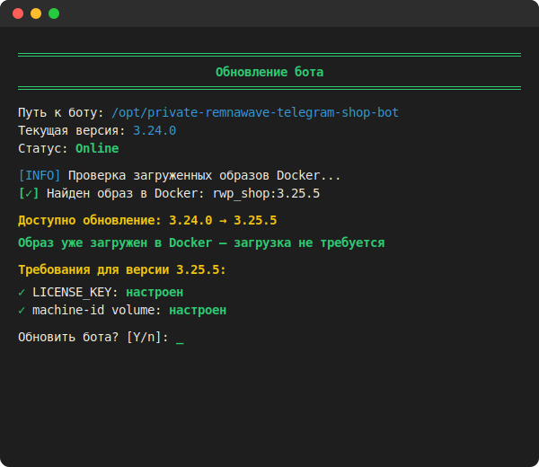
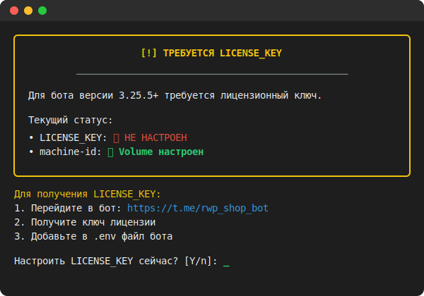
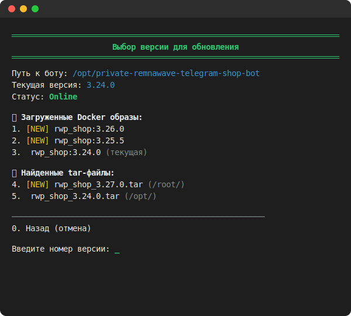
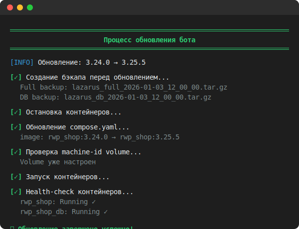
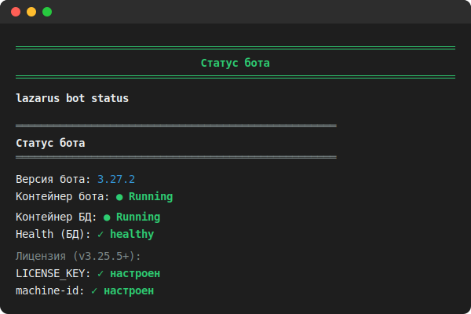

# 🔄 LAZARUS Bot Update — Обновление Remnawave Telegram Shop Bot

<div align="center">

### 🌐 Language / Язык

[](README.en.md)
[](README.md)


**Полное руководство по обновлению бота через LAZARUS Backup Manager**

</div>

---

## 📋 Содержание

1. [Быстрый старт](#-быстрый-старт)
2. [Требования для версий 3.25.5+](#-требования-для-версий-3255)
3. [Способы обновления](#-способы-обновления)
4. [Интерактивное обновление](#-интерактивное-обновление)
5. [CLI команды](#-cli-команды)
6. [Управление контейнерами](#-управление-контейнерами)
7. [Поддерживаемые форматы образов](#-поддерживаемые-форматы-образов)
8. [Устранение проблем](#-устранение-проблем)

---

## 🚀 Быстрый старт

### Обновление из меню
```bash
lazarus
# Выбрать: 6. Обновить бота
```

<details>
<summary>📸 Меню обновления бота</summary>



</details>

### Автоматическое обновление (CLI)
```bash
lazarus upgrade
# или
lazarus bot upgrade
# или короткая форма
lazarus -b -u
```

---

## ⚠️ Требования для версий 3.25.5+

Начиная с версии **3.25.5** Remnawave Telegram Shop Bot требует:

### 1. LICENSE_KEY

64-символьный ключ лицензии в формате hex (`[0-9a-f]{64}`).

**Где получить:** Официальные каналы Remnawave

**Где настроить:**
- Файл `.env` в папке бота
- Или через меню LAZARUS при обновлении

**Пример в .env:**
```env
LICENSE_KEY=a1b2c3d4e5f6...64символа...
```

### 2. Machine-ID Volume

Docker volume для привязки лицензии к серверу.

**Автоматически добавляется в compose.yaml:**
```yaml
volumes:
  - /etc/machine-id:/etc/machine-id:ro
```

### Проверка при запуске скрипта

LAZARUS автоматически проверяет эти требования при старте:

<details>
<summary>📸 Предупреждение о LICENSE_KEY</summary>



</details>

```
╔══════════════════════════════════════════════════════════════╗
║            [!] ВНИМАНИЕ: ТРЕБУЕТСЯ LICENSE_KEY               ║
╠══════════════════════════════════════════════════════════════╣
║  Для бота версии 3.25.5+ требуется лицензионный ключ.        ║
║                                                              ║
║  Текущий статус:                                             ║
║  • LICENSE_KEY:    ❌ НЕ НАСТРОЕН                            ║
║  • machine-id:     ✅ Volume настроен                        ║
╚══════════════════════════════════════════════════════════════╝
```

---

## 📦 Способы обновления

### 1. Из загруженного Docker образа (рекомендуется)

Если образ уже загружен в Docker (например, через `docker load`), LAZARUS обнаружит его автоматически:

```
╔══════════════════════════════════════════════════════════════╗
║          НОВАЯ ВЕРСИЯ УЖЕ ЗАГРУЖЕНА В DOCKER                 ║
╠══════════════════════════════════════════════════════════════╣
║  В docker-compose:  3.24.0                                   ║
║  Загружен образ:    3.25.5 (новее)                           ║
║                                                              ║
║  Можно обновиться без поиска tar-файлов!                     ║
╚══════════════════════════════════════════════════════════════╝
```

### 2. Из tar-файла

LAZARUS ищет tar-файлы в следующих директориях:
- `/root/`
- `/opt/`
- `/home/*/`
- `/tmp/`
- Папка бота (`BOT_PATH`)
- Текущая директория

---

## 🖥️ Интерактивное обновление

### Шаг 1: Выбор версии

<details>
<summary>📸 Выбор версии для обновления</summary>



</details>

```
═══════════════════════════════════════════════════
  ОБНОВЛЕНИЕ БОТА — Remnawave Telegram Shop Bot
═══════════════════════════════════════════════════

Текущая версия: 3.24.0

📦 Загруженные Docker образы:
  1. [NEW] rwp_shop:3.25.5

📄 Найденные tar-файлы:
  2. [NEW] rwp_shop_3.26.0.tar (/root/)
  3.       rwp_shop_3.24.0.tar (/opt/)

Введите номер версии (или 0 для отмены):
```

### Шаг 2: Проверка требований (для 3.25.5+)

```
╔══════════════════════════════════════════════════════════════╗
║            ТРЕБОВАНИЯ ДЛЯ ВЕРСИИ 3.25.5+                     ║
╠══════════════════════════════════════════════════════════════╣
║                                                              ║
║  • LICENSE_KEY:    ❌ НЕ НАЙДЕН                              ║
║  • machine-id:     ✅ Volume настроен                        ║
║                                                              ║
╚══════════════════════════════════════════════════════════════╝

Настроить LICENSE_KEY сейчас? [Y/n]:
```

### Шаг 3: Автоматический бэкап

Перед обновлением создаётся:
- **Full backup** — полная копия (БД + файлы)
- **DB backup** — отдельная копия базы данных

### Шаг 4: Обновление

<details>
<summary>📸 Процесс обновления</summary>



</details>

1. Загрузка образа (если из tar)
2. Обновление версии в `compose.yaml`
3. Добавление LICENSE_KEY в `.env` (если настроен)
4. Добавление machine-id volume (если отсутствует)
5. Перезапуск контейнеров
6. Health-check

### Шаг 5: Очистка tar-файлов

```
🧹 Найдены установочные tar-файлы:
  1. /root/rwp_shop_3.25.5.tar (245 MB)
  2. /root/rwp_shop_3.24.0.tar (240 MB)

Удалить эти файлы для освобождения места? [Y/n]:
```

---

## 💻 CLI команды

### Обновление бота

| Команда | Описание |
|---------|----------|
| `lazarus upgrade` | Автоматическое обновление |
| `lazarus bot upgrade` | То же самое |
| `lazarus bot update` | То же самое |
| `lazarus -b -u` | Короткая форма |

### Резервное копирование

| Команда | Описание |
|---------|----------|
| `lazarus backup create` | Полный бэкап (БД + файлы) |
| `lazarus backup db` | Только база данных |
| `lazarus backup files` | Только файлы |
| `lazarus backup list` | Список бэкапов |
| `lazarus -B -c` | Короткая форма create |
| `lazarus -B -d` | Короткая форма db |

### Управление контейнерами

| Команда | Описание |
|---------|----------|
| `lazarus bot up` | Запустить контейнеры |
| `lazarus bot down` | Остановить контейнеры |
| `lazarus bot status` | Показать статус |
| `lazarus -b -s` | Короткая форма статуса |

### Примеры

```bash
# Создать полный бэкап
lazarus backup create

# Проверить статус контейнеров
lazarus bot status

# Перезапустить бота
lazarus bot down && lazarus bot up

# Обновить с автоподтверждением (для скриптов)
lazarus --yes upgrade
```

---

## 🐳 Управление контейнерами

### Статус контейнеров

<details>
<summary>📸 Статус контейнеров</summary>



</details>

```bash
lazarus bot status
```

Вывод:
```
═══════════════════════════════════════════════════
  СТАТУС КОНТЕЙНЕРОВ
═══════════════════════════════════════════════════

📦 rwp_shop:        ✅ Running (Up 2 hours)
🗄️  rwp_shop_db:     ✅ Running (Up 2 hours)
🌐 rwp_shop_redis:  ✅ Running (Up 2 hours)

Версия бота: 3.25.5
```

### Запуск контейнеров

```bash
lazarus bot up
```

Выполняет:
```bash
cd /opt/private-remnawave-telegram-shop-bot && docker compose up -d
```

### Остановка контейнеров

```bash
lazarus bot down
```

Выполняет:
```bash
cd /opt/private-remnawave-telegram-shop-bot && docker compose down
```

---

## 📄 Поддерживаемые форматы образов

| Формат файла | Пример | Примечание |
|--------------|--------|------------|
| `rwp_shop_X.Y.Z.tar` | `rwp_shop_3.25.5.tar` | Рекомендуемый |
| `rwp_shop-X.Y.Z-amd64.tar` | `rwp_shop-3.25.5-amd64.tar` | Legacy |
| `private-remnawave-telegram-shop-bot-X.Y.Z.tar` | `private-remnawave-telegram-shop-bot-3.25.5.tar` | Полное имя |

### Docker образы

| Имя образа | Пример |
|------------|--------|
| `rwp_shop` | `rwp_shop:3.25.5` |
| `private-remnawave-telegram-shop-bot` | `private-remnawave-telegram-shop-bot:3.25.5` |

---

## 🔧 Устранение проблем

### ❌ LICENSE_KEY не найден

**Проблема:** Бот не запускается с ошибкой лицензии

**Решение:**
1. Получите LICENSE_KEY из официальных каналов
2. Добавьте в `.env`:
   ```env
   LICENSE_KEY=ваш64символьныйключ
   ```
3. Или настройте через LAZARUS:
   ```bash
   lazarus
   # 6. Обновить бота → Настроить LICENSE_KEY
   ```

### ❌ Machine-ID volume не настроен

**Проблема:** Лицензия не привязывается к серверу

**Решение:**
LAZARUS автоматически добавляет volume при обновлении. Если нужно вручную:

```yaml
# compose.yaml
services:
  rwp_shop:
    volumes:
      - /etc/machine-id:/etc/machine-id:ro
```

### ❌ Образ не найден

**Проблема:** Нет доступных версий для обновления

**Решение:**
1. Скачайте tar-файл с образом
2. Положите в `/root/` или `/opt/`
3. Или загрузите напрямую в Docker:
   ```bash
   docker load -i rwp_shop_3.25.5.tar
   ```

### ❌ Контейнер не запускается после обновления

**Проблема:** Health-check не проходит

**Решение:**
1. Проверьте логи:
   ```bash
   docker logs rwp_shop
   ```
2. Проверьте LICENSE_KEY и machine-id
3. Восстановите из бэкапа:
   ```bash
   lazarus restore
   ```

### ❌ Несоответствие версий

**Проблема:** Версия в compose.yaml не соответствует загруженному образу

**Решение:**
LAZARUS автоматически обновляет compose.yaml. Если нужно вручную:

```yaml
# compose.yaml
services:
  rwp_shop:
    image: rwp_shop:3.25.5  # Укажите нужную версию
```

---

## 📊 Логирование

Для детальной диагностики используйте debug-режим:

```bash
lazarus --debug bot upgrade
```

Категории логов:
- `UPDATE` — процесс обновления
- `DOCKER` — операции с Docker
- `COMPOSE` — изменения compose.yaml
- `LICENSE` — проверка лицензии
- `HEALTH` — health-check контейнеров

---

## 🔗 Связанные документы

- [Главный README](../README.md) — обзор LAZARUS
- [Миграция с Bedolaga](../migration/README.md) — перенос данных
- [Официальная документация RWP-Shop](https://remnawave-telegram-shop-bot-doc.vercel.app/ru/private/overview/)

---

<div align="center">

**LAZARUS Backup Manager v4.31.0-dev**

</div>
