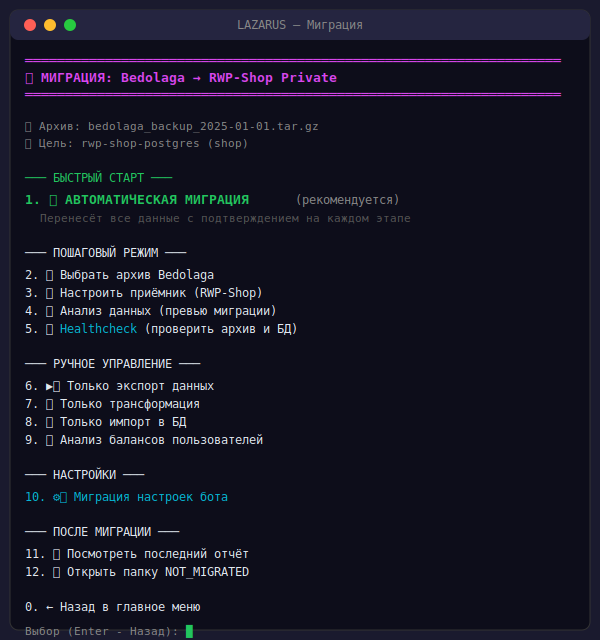
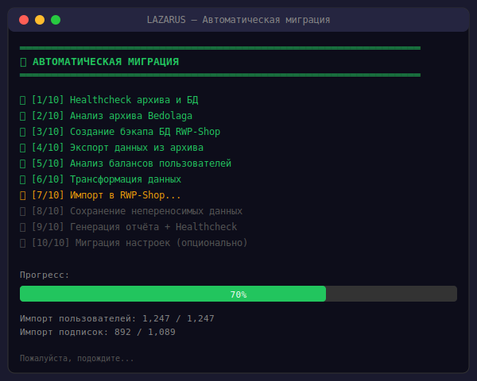
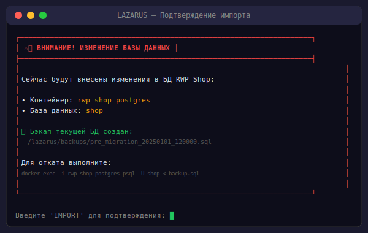
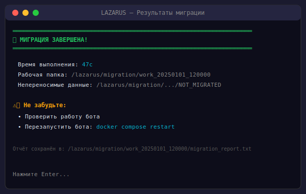
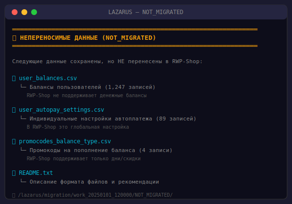

# 🔄 LAZARUS Migration — Миграция с Bedolaga на RWP-Shop

<div align="center">


**🇬🇧 [English version](README.en.md)**

**Полное руководство по миграции данных из Telegram-бота Bedolaga в RWP-Shop (RemnaWave Panel Shop)**

</div>

---

## ⚠️ ДИСКЛЕЙМЕР

> [!CAUTION]
> **ЭТО ТЕСТОВЫЙ ПРОДУКТ!**
> 
> Данный инструмент миграции находится в стадии **бета-тестирования**.
> 
> **Используя этот инструмент, вы:**
> - ✅ Полностью берёте на себя все риски, связанные с миграцией данных
> - ✅ Понимаете, что могут возникнуть непредвиденные ситуации
> - ✅ Согласны самостоятельно устранять возможные проблемы
> 
> **Автор СНИМАЕТ С СЕБЯ ОТВЕТСТВЕННОСТЬ за:**
> - ❌ Потерю данных в процессе миграции
> - ❌ Неполную или некорректную миграцию данных
> - ❌ Нарушение работы целевой системы RWP-Shop
> - ❌ Финансовые потери, связанные с миграцией
> - ❌ Любой прямой или косвенный ущерб
> 
> **ОБЯЗАТЕЛЬНО сделайте полный бэкап ОБЕИХ систем перед началом миграции!**

---

## 📋 Содержание

1. [Что такое LAZARUS Migration](#-что-такое-lazarus-migration)
2. [Возможности мигратора](#-возможности-мигратора)
3. [Галерея скриншотов](#-галерея-скриншотов)
4. [Таблица покрытия миграции](#-таблица-покрытия-миграции)
5. [Что НЕ мигрируется](#-что-не-мигрируется)
6. [Подготовка к миграции](#-подготовка-к-миграции)
7. [Процесс миграции](#-процесс-миграции)
8. [После миграции](#-после-миграции)
9. [Решение проблем](#-решение-проблем)

---

## 🎯 Что такое LAZARUS Migration

**LAZARUS Migration** — это модуль инструмента LAZARUS Backup Manager, предназначенный для переноса данных из Telegram-бота **Bedolaga** в **RWP-Shop** (RemnaWave Panel Shop).

### Зачем это нужно?

Если вы использовали бота Bedolaga и хотите перейти на RWP-Shop, вам нужно:
- Перенести пользователей с их Telegram ID
- Сохранить подписки и их сроки
- Перенести историю транзакций
- Сохранить промокоды
- Перенести реферальную систему
- Настроить бота с теми же параметрами

**LAZARUS Migration делает всё это автоматически!**

---

## ✨ Возможности мигратора

| Функция | Описание |
|---------|----------|
| 🔄 **Автоматическая миграция** | Полный цикл миграции в 10 шагов с минимальным участием пользователя |
| 📊 **Пошаговая миграция** | Ручное выполнение каждого этапа для полного контроля |
| 🩺 **Healthcheck** | Проверка целостности данных до и после миграции |
| 💾 **Автобэкап** | Автоматическое создание бэкапа БД перед импортом |
| 📁 **Сохранение несовместимых данных** | Данные без аналога в RWP-Shop сохраняются в отдельную папку |
| ⚙️ **Миграция настроек** | Перенос токена бота, каналов, тарифов из .env |
| 📈 **Отчёты** | Детальные отчёты о результатах миграции |

---

## 📸 Галерея скриншотов

### 1️⃣ Главное меню миграции

<p align="center">
  
</p>

### 2️⃣ Выбор архива Bedolaga

<p align="center">
  
</p>

### 3️⃣ Анализ архива

<p align="center">
  
</p>

### 4️⃣ Автоматическая миграция (в процессе)

<p align="center">
  
</p>

### 5️⃣ Предупреждение перед импортом

<p align="center">
  
</p>

### 6️⃣ Результаты миграции

<p align="center">
  
</p>

### 7️⃣ Папка NOT_MIGRATED

<p align="center">
  
</p>

---

## 📊 Таблица покрытия миграции

### Общее покрытие: **~88%**

| Категория | Bedolaga | RWP-Shop | Покрытие | Статус |
|-----------|----------|----------|:--------:|:------:|
| **👤 Пользователи** | | | **~95%** | ✅ |
| ├─ telegram_id | telegram_id | telegram_id | 100% | ✅ |
| ├─ username | username | username | 100% | ✅ |
| ├─ first_name | first_name | first_name | 100% | ✅ |
| ├─ last_name | last_name | last_name | 100% | ✅ |
| ├─ language_code | language_code | language_code | 100% | ✅ |
| ├─ is_bot | — | — | — | ➖ |
| ├─ balance | balance_kopeks | — | 0% | ❌ |
| ├─ referral_code | referral_code | referral_code | 100% | ✅ |
| ├─ referred_by | referrer_id | referrer_telegram_id | 100% | ✅ |
| ├─ created_at | created_at | created_at | 100% | ✅ |
| └─ autopay_days_before | autopay_days_before | — (глобально) | 0% | ⚠️ |
| **📋 Подписки** | | | **~90%** | ✅ |
| ├─ subscription_id | id | id | 100% | ✅ |
| ├─ user_id | user_telegram_id → | user_telegram_id | 100% | ✅ |
| ├─ remnawave_uuid | remnawave_username | subscription_uuid | 100% | ✅ |
| ├─ tariff_id | tariff_id | plan_id | 100% | ✅ |
| ├─ start_date | start_date | start_date | 100% | ✅ |
| ├─ end_date | end_date | end_date | 100% | ✅ |
| ├─ status | is_active | is_active | 100% | ✅ |
| ├─ device_limit | device_limit | — (в тарифе) | 0% | ⚠️ |
| └─ auto_renew | auto_renew | auto_renew | 100% | ✅ |
| **💳 Транзакции** | | | **~85%** | ✅ |
| ├─ transaction_id | id | id | 100% | ✅ |
| ├─ user_id | user_telegram_id → | user_telegram_id | 100% | ✅ |
| ├─ amount | amount | amount | 100% | ✅ |
| ├─ currency | — | currency | 100% | ✅ |
| ├─ status | status | status | 100% | ✅ |
| ├─ payment_system | payment_system | provider | 100% | ✅ |
| ├─ external_id | external_id | provider_payment_id | 100% | ✅ |
| ├─ created_at | created_at | created_at | 100% | ✅ |
| └─ metadata | metadata | — | 0% | ⚠️ |
| **🎟️ Промокоды** | | | **~100%** | ✅ |
| ├─ code | code | code | 100% | ✅ |
| ├─ type | subscription_days | subscription / discount | 100% | ✅ |
| ├─ value | subscription_days | duration_days / discount | 100% | ✅ |
| ├─ usage_limit | max_usages | max_usages | 100% | ✅ |
| ├─ usage_count | usage_count | usage_count | 100% | ✅ |
| ├─ expires_at | valid_until | end_date | 100% | ✅ |
| └─ bonus_kopeks | bonus_kopeks | — | 0% | ❌ |
| **👥 Рефералы** | | | **~80%** | ✅ |
| ├─ referrer_id | referrer_telegram_id | referrer_telegram_id | 100% | ✅ |
| ├─ referred_id | referred_telegram_id | referred_telegram_id | 100% | ✅ |
| ├─ bonus | referral_bonus | referral_bonus_days | ~80% | ⚠️ |
| └─ created_at | created_at | created_at | 100% | ✅ |
| **⚙️ Настройки** | | | **~85%** | ✅ |
| ├─ BOT_TOKEN | TELEGRAM_BOT_TOKEN | TELEGRAM_BOT_TOKEN | 100% | ✅ |
| ├─ CHANNEL_ID | PRIVATE_CHANNEL | CHANNEL_ID | 100% | ✅ |
| ├─ NEWS_CHANNEL | NEWS_CHANNEL | NEWS_CHANNEL_ID | 100% | ✅ |
| ├─ ADMIN_IDS | ADMIN_TELEGRAM_IDS | TELEGRAM_ADMIN_IDS | 100% | ✅ |
| ├─ TARIFFS | — (в БД) | — (в БД) | 100% | ✅ |
| └─ TEXTS | — | — | ~70% | ⚠️ |

---

## ❌ Что НЕ мигрируется

### Данные без аналога в RWP-Shop

| Данные Bedolaga | Причина | Что происходит |
|-----------------|---------|----------------|
| **Балансы пользователей** (`balance_kopeks`) | RWP-Shop не поддерживает денежные балансы | Сохраняются в `NOT_MIGRATED/user_balances.csv` |
| **Промокоды на баланс** (`bonus_kopeks > 0`) | RWP-Shop поддерживает только дни/скидки | Сохраняются в `NOT_MIGRATED/promocodes_balance_type.csv` |
| **Индивидуальные autopay_days_before** | В RWP-Shop это глобальная настройка | Сохраняются в `NOT_MIGRATED/user_autopay_settings.csv` |
| **device_limit подписки** | В RWP-Shop лимит в тарифе Remnawave | Не переносится |
| **Метаданные транзакций** | Нет аналогичного поля | Не переносятся |
| **TRAFFIC_PACKAGES_CONFIG** | Функция покупки трафика отсутствует | Не переносится |
| **Реферальные бонусы в копейках** | RWP-Shop использует дни | Конвертируется с потерей точности |

### Архитектурные различия

| Аспект | Bedolaga | RWP-Shop |
|--------|----------|----------|
| **Балансы** | Денежные (копейки) | Отсутствуют |
| **Промокоды** | 3 типа (дни, баланс, скидка) | 2 типа (дни, скидка) |
| **Автоплатёж** | Индивидуальная настройка | Глобальная настройка |
| **Лимит устройств** | В подписке | В тарифе Remnawave |
| **Реферальные бонусы** | В копейках | В днях подписки |

---

## 🔧 Подготовка к миграции

> [!TIP]
> **Рекомендуемое время:** 30-60 минут на подготовку + 5-15 минут на миграцию

### 📋 Чек-лист перед началом

Убедитесь, что у вас есть всё необходимое:

- [ ] **Сервер с RWP-Shop** — бот должен быть установлен и работать
- [ ] **Архив Bedolaga** — файл `backup_*.tar.gz` или `backup_*.tar.zip`
- [ ] **SSH доступ** к серверу с RWP-Shop
- [ ] **30-60 минут** свободного времени
- [ ] **Пароль от архива** (если архив зашифрован)

---

### Шаг 1: Проверка требований к системе

#### Минимальные требования:
| Компонент | Требование | Проверка |
|-----------|------------|----------|
| ОС | Linux (Ubuntu 20.04+, Debian 10+, CentOS 8+) | `cat /etc/os-release` |
| Docker | 20.10+ | `docker --version` |
| Docker Compose | 2.0+ | `docker compose version` |
| Bash | 4.0+ | `bash --version` |
| Свободное место | 500MB+ | `df -h /` |
| RWP-Shop | Установлен и работает | `docker ps \| grep rwp` |

#### Команды для проверки:

```bash
# 1. Проверить версию Docker
docker --version
# Ожидаемый вывод: Docker version 24.x.x или выше

# 2. Проверить Docker Compose
docker compose version
# Ожидаемый вывод: Docker Compose version v2.x.x

# 3. Проверить, что RWP-Shop запущен
docker ps | grep -E "rwp|shop|postgres"
# Должны быть видны контейнеры: rwp-shop-bot, rwp-shop-postgres

# 4. Проверить подключение к БД
docker exec rwp-shop-postgres psql -U shop -d shop -c "SELECT 1;"
# Ожидаемый вывод: ?column? = 1

# 5. Проверить свободное место
df -h /
# Должно быть минимум 500MB свободно
```

---

### Шаг 2: Размещение архива Bedolaga

> [!IMPORTANT]
> **Архив бэкапа Bedolaga должен находиться рядом с docker-compose файлом RWP-Shop.**
>
> Обычно это папка `/opt/rwp-shop/` или `/opt/private-remnawave-telegram-shop-bot/`

#### Загрузка архива на сервер:

```bash
# Если архив на вашем компьютере — загрузите через SCP:
scp ~/Downloads/backup_20250101_120000.tar.zip root@ваш-сервер:/opt/rwp-shop/

# Или через SFTP (FileZilla, WinSCP и т.д.)
```

#### Проверка:

```bash
# Перейти в папку RWP-Shop
cd /opt/rwp-shop  # или /opt/private-remnawave-telegram-shop-bot

# Убедиться, что архив на месте
ls -la backup_*.tar.*
```

> [!NOTE]
> **Как получить архив Bedolaga?**
> Обратитесь к документации Bedolaga или к разработчикам за инструкцией по созданию бэкапа.

---

### Шаг 3: Создание бэкапа RWP-Shop (ОБЯЗАТЕЛЬНО!)

> [!CAUTION]
> **КРИТИЧЕСКИ ВАЖНО!** Перед миграцией ОБЯЗАТЕЛЬНО сделайте бэкап RWP-Shop!
> Если что-то пойдёт не так — вы сможете откатиться.

#### Способ 1: Через LAZARUS (рекомендуется)

```bash
# 1. Запустите LAZARUS
cd /opt/lazarus-backup
./lazarus

# 2. Выберите: 1. Создать бэкап
# 3. Выберите: 4. Полный бэкап (БД + файлы)
# 4. Дождитесь завершения

# Бэкап будет сохранён в /opt/lazarus-backup/backup/
```

#### Способ 2: Ручной бэкап PostgreSQL

```bash
# Создать дамп базы данных
docker exec rwp-shop-postgres pg_dump -U shop -d shop > /root/rwp_shop_backup_$(date +%Y%m%d_%H%M%S).sql

# Проверить, что файл создан
ls -la /root/rwp_shop_backup_*.sql
```

---

### Шаг 4: Установка LAZARUS Backup Manager

```bash
# Новая установка (DEV-версия с миграцией)
bash <(curl -sSL https://raw.githubusercontent.com/UnderGut/LAZARUS-Backup-Manager/dev/lazarus-backup)

# LAZARUS будет установлен в /opt/lazarus-backup
```

#### Если LAZARUS уже установлен:

```bash
# Обновите до dev-версии с миграцией (бэкапы сохранятся)
curl -sSL https://raw.githubusercontent.com/UnderGut/LAZARUS-Backup-Manager/dev/lazarus-backup -o /opt/lazarus-backup/lazarus && chmod +x /opt/lazarus-backup/lazarus
```

---

### Шаг 5: Проверка архива Bedolaga

Убедитесь, что архив корректный:

```bash
# 1. Перейти в папку RWP-Shop (где лежит архив)
cd /opt/rwp-shop

# 2. Проверить, что файл существует
ls -la backup_*.tar.gz
# или
ls -la backup_*.tar.zip

# 3. Проверить размер (должен быть > 1MB для реальных данных)
du -h backup_*.tar.*

# 4. Проверить содержимое архива
# Для .tar.gz:
tar -tzvf backup_*.tar.gz | head -20

# Для .tar.zip (зашифрованный):
unzip -l backup_*.tar.zip
```

#### Что должно быть внутри архива:

```
backup_20250101_120000/
├── database.json          ← Главный файл с данными (ОБЯЗАТЕЛЬНО)
├── database_backups/      ← Папка с бэкапами таблиц
│   ├── users.json
│   ├── subscriptions.json
│   ├── transactions.json
│   └── ...
├── config.env             ← Настройки бота
└── .env                   ← Альтернативный файл настроек
```

---

### Шаг 6: Подготовка пароля (для зашифрованных архивов)

Если ваш архив имеет расширение `.tar.zip` — он зашифрован.

#### Проверить, нужен ли пароль:

```bash
# Попробовать распаковать без пароля
unzip -t backup_*.tar.zip

# Если выдаёт "incorrect password" — пароль нужен
```

> [!NOTE]
> **Где найти пароль?**
> Пароль от архива вы должны были получить при создании бэкапа в Bedolaga.
> Обратитесь к документации Bedolaga, если не знаете пароль.

---

### 🎯 Финальный чек-лист перед миграцией

Перед запуском миграции убедитесь:

| # | Пункт | Статус |
|---|-------|--------|
| 1 | RWP-Shop работает (`docker ps`) | ☐ |
| 2 | Бэкап RWP-Shop создан | ☐ |
| 3 | Архив Bedolaga в папке RWP-Shop | ☐ |
| 4 | LAZARUS установлен | ☐ |
| 5 | Пароль от архива известен (если нужен) | ☐ |
| 6 | 30-60 минут свободного времени | ☐ |

**Всё готово? Переходите к [Процессу миграции](#-процесс-миграции)!**

---

## 🚀 Процесс миграции

### 🎬 Быстрый старт (для нетерпеливых)

```bash
# 1. Запустить LAZARUS
cd /opt/lazarus-backup
./lazarus

# 2. Выбрать: 5 → Миграция
# 3. Ввести: YES (принять дисклеймер)
# 4. Выбрать архив (или ввести путь)
# 5. Выбрать: 1 → Автоматическая миграция
# 6. Подтвердить: y
# 7. Ввести: IMPORT (когда попросит)
# 8. Выбрать: y (мигрировать настройки) или n (пропустить)
# 9. Готово! 🎉
```

---

### Метод 1: Автоматическая миграция (рекомендуется)

**Подходит для:** Большинства случаев, когда нужна быстрая и безопасная миграция.

#### 📖 Пошаговая инструкция

##### 1. Запуск LAZARUS

```bash
cd /opt/lazarus-backup
./lazarus
```

Вы увидите главное меню LAZARUS.

##### 2. Переход в меню миграции

Введите `5` и нажмите Enter:

```
Выберите действие: 5
```

##### 3. Принятие дисклеймера

Вам покажут предупреждение о рисках миграции. Прочитайте внимательно и введите `YES`:

```
Введите YES для продолжения: YES
```

> [!WARNING]
> Если введёте что-то другое — вернётесь в главное меню.

##### 4. Выбор архива Bedolaga

Скрипт автоматически найдёт архивы в папке RWP-Shop бота и стандартных директориях.

Выберите номер архива или введите `0` для ручного ввода пути:

```
Найденные архивы:
  1. 📦 2025-01-01 12:00 (245 MB) ← РЕКОМЕНДУЕТСЯ
  2. 📦 2024-12-31 18:30 (240 MB)
  3. 🔒 2024-12-30 06:00 (238 MB)  ← зашифрованный

Номер файла или команда (Enter - Назад): 1
```

> [!TIP]
> 🔒 означает, что архив зашифрован — потребуется пароль.

##### 5. Ввод пароля (если архив зашифрован)

Если архив защищён паролем:

```
⚠️ Архив защищён паролем

Введите пароль: ********
✅ Пароль верный
```

##### 6. Главное меню миграции

После выбора архива вы увидите меню миграции. Выберите `1`:

```
─── БЫСТРЫЙ СТАРТ ───
 1. 🚀 АВТОМАТИЧЕСКАЯ МИГРАЦИЯ (рекомендуется)
    Перенесёт все данные с подтверждением на каждом этапе

Выбор (Enter - Назад): 1
```

##### 7. Подтверждение запуска

Скрипт покажет план миграции. Введите `y`:

```
Будут выполнены следующие действия:

  [1/10] 🏥 Healthcheck архива и БД
  [2/10] 🔍 Анализ архива Bedolaga
  [3/10] 💾 Создание бэкапа БД RWP-Shop
  [4/10] 📤 Экспорт данных из архива
  [5/10] 💰 Анализ и обработка балансов
  [6/10] 🔄 Трансформация данных
  [7/10] 📥 Импорт в RWP-Shop
  [8/10] ⚙️  Миграция настроек (опционально)
  [9/10] 📁 Сохранение непереносимых данных
  [10/10] 📋 Генерация отчёта + Финальный healthcheck

Продолжить? (y/N): y
```

##### 8. Наблюдение за процессом

Миграция выполняется автоматически. Вы увидите прогресс:

```
✅ [1/10] Healthcheck архива и БД
✅ [2/10] Анализ архива Bedolaga
   → Пользователей: 1247
   → Подписок: 1089
   → Транзакций: 3456
✅ [3/10] Создание бэкапа БД RWP-Shop
   → /opt/lazarus-backup/backup/pre_migration_20250101_120000.sql
✅ [4/10] Экспорт данных из архива
✅ [5/10] Анализ балансов
   ⚠️ 847 пользователей с ненулевым балансом
✅ [6/10] Трансформация данных
```

##### 9. Подтверждение импорта (ВАЖНО!)

Перед импортом скрипт покажет предупреждение и попросит подтверждение:

```
┌────────────────────────────────────────────────────────────────────┐
│  ⚠️ ВНИМАНИЕ! ИЗМЕНЕНИЕ БАЗЫ ДАННЫХ                               │
├────────────────────────────────────────────────────────────────────┤
│                                                                    │
│  Сейчас будут внесены изменения в БД RWP-Shop:                    │
│                                                                    │
│  • Контейнер: rwp-shop-postgres                                   │
│  • База данных: shop                                              │
│                                                                    │
│  🔒 Бэкап текущей БД создан:                                       │
│     /opt/lazarus-backup/backup/pre_migration_20250101_120000.sql  │
│                                                                    │
└────────────────────────────────────────────────────────────────────┘

Введите 'IMPORT' для подтверждения: IMPORT
```

> [!CAUTION]
> Введите **IMPORT** заглавными буквами! Любой другой ввод отменит импорт.

##### 10. Миграция настроек (опционально)

После импорта данных скрипт предложит мигрировать настройки:

```
[10/10] Миграция настроек...

Хотите перенести настройки из Bedolaga в RWP-Shop?
  • Будут перенесены: токен бота, каналы, тарифы, тексты и др.
  • Существующие настройки в .env будут заменены

Мигрировать настройки? (y/n): y
```

- **y** — перенести токен бота, каналы, админов и т.д.
- **n** — оставить текущие настройки RWP-Shop

##### 11. Завершение миграции

```
═══════════════════════════════════════════════════════════════════
  ✅ МИГРАЦИЯ ЗАВЕРШЕНА!
═══════════════════════════════════════════════════════════════════

  Время выполнения: 47с
  Рабочая папка: MIGRATION/20250101_120000
  Непереносимые данные: MIGRATION/20250101_120000/NOT_MIGRATED

⚠️ Не забудьте:
  • Проверить работу бота
  • Перезапустить бота: docker compose restart
```

#### ✅ Что делать сразу после миграции

После завершения автоматической миграции переходите к разделу **"После миграции"** ниже.

---

### Метод 2: Пошаговая миграция

**Подходит для:** Опытных пользователей, которые хотят контролировать каждый этап.

#### Порядок выполнения:

```
1. Выбрать архив (пункт 8)
2. Анализ архива (пункт 6)
3. Healthcheck (пункт 7)
4. Экспорт данных (пункт 2)
5. Трансформация (пункт 3)
6. Импорт (пункт 4)
7. Миграция настроек (пункт 5)
```

#### Подробное описание каждого пункта:

| Пункт | Название | Описание |
|:-----:|----------|----------|
| **1** | Автоматическая миграция | Выполняет все шаги последовательно |
| **2** | Экспорт данных | Извлекает JSON из архива, конвертирует в CSV |
| **3** | Трансформация | Преобразует данные Bedolaga → RWP-Shop |
| **4** | Импорт | Загружает данные в PostgreSQL RWP-Shop |
| **5** | Миграция настроек | Переносит токен, каналы, тарифы из .env |
| **6** | Анализ архива | Показывает статистику данных в архиве |
| **7** | Healthcheck | Проверяет целостность CSV и БД |
| **8** | Выбрать архив | Меняет архив для миграции |

---

## ✅ После миграции

### 📋 Обязательный чек-лист после миграции

| # | Действие | Команда | Статус |
|---|----------|---------|--------|
| 1 | Перезапустить бота | `docker compose restart` | ☐ |
| 2 | Проверить логи на ошибки | `docker compose logs bot --tail 100` | ☐ |
| 3 | Открыть бота в Telegram | Нажать /start | ☐ |
| 4 | Проверить свой профиль | Нажать "Профиль" | ☐ |
| 5 | Проверить подписки | Нажать "Мои подписки" | ☐ |
| 6 | Просмотреть NOT_MIGRATED | См. команду ниже | ☐ |

---

### Шаг 1: Перезапуск бота (ОБЯЗАТЕЛЬНО!)

```bash
# Перейти в папку RWP-Shop
cd /opt/rwp-shop
# или
cd /opt/private-remnawave-telegram-shop-bot

# Перезапустить все контейнеры
docker compose restart

# Или только бота
docker compose restart bot
```

### Шаг 2: Проверка логов

```bash
# Смотреть логи в реальном времени
docker compose logs -f bot

# Посмотреть последние 100 строк
docker compose logs bot --tail 100

# Искать ошибки
docker compose logs bot 2>&1 | grep -i error
```

**Что искать в логах:**
- ✅ Сообщения об успешном запуске
- ✅ Отсутствие ошибок
- ❌ `Error`, `error` — ошибки (требуют внимания)
- ❌ `Exception`, `exception` — исключения

### Шаг 3: Проверка в Telegram

1. **Откройте бота** в Telegram
2. **Нажмите /start** или кнопку "Начать"
3. **Проверьте:**
   - Профиль отображается
   - Подписки видны
   - Кнопки работают

### Шаг 4: Проверка данных в БД

```bash
# Подключиться к PostgreSQL
docker exec -it rwp-shop-postgres psql -U shop -d shop

# Проверить количество пользователей
SELECT COUNT(*) as users FROM customer;

# Проверить количество подписок
SELECT COUNT(*) as subscriptions FROM customer WHERE subscription_uuid IS NOT NULL;

# Проверить промокоды
SELECT COUNT(*) as promocodes FROM promo;

# Проверить транзакции
SELECT COUNT(*) as purchases FROM purchase;

# Выйти
\q
```

### Шаг 5: Проверка непереносимых данных

После миграции рабочая папка создаётся в папке RWP-Shop бота:

```bash
# Перейти в папку RWP-Shop
cd /opt/rwp-shop  # или /opt/private-remnawave-telegram-shop-bot

# Посмотреть рабочие папки миграции
ls -la MIGRATION/

# Посмотреть что не перенеслось (в последней папке миграции)
ls -la MIGRATION/*/NOT_MIGRATED/

# Прочитать описание
cat MIGRATION/*/NOT_MIGRATED/README.txt

# Посмотреть балансы пользователей (если есть)
head -20 MIGRATION/*/NOT_MIGRATED/user_balances.csv
```

---

### 💰 Что делать с балансами пользователей

В RWP-Shop нет денежных балансов. Если у пользователей были деньги на балансе:

#### Вариант 1: Выдать промокоды

```bash
# Посмотреть балансы
cat MIGRATION/*/NOT_MIGRATED/user_balances.csv

# Формат: telegram_id,username,balance_kopeks,balance_rub
# Пример: 123456789,username,15000,150.00
```

Создайте промокоды на дни подписки по курсу (например, 100₽ = 30 дней).

#### Вариант 2: Связаться с пользователями

Отправьте сообщение пользователям с большим балансом через бота или напрямую.

#### Вариант 3: Оставить как есть

Балансы будут утеряны. Подходит, если суммы небольшие.

---

### 🎟️ Что делать с промокодами на баланс

```bash
# Посмотреть промокоды на баланс
cat MIGRATION/*/NOT_MIGRATED/promocodes_balance_type.csv
```

Эти промокоды давали деньги на баланс. В RWP-Shop они не работают.

**Решение:** Создайте новые промокоды на дни подписки с похожими кодами.

---

## 🔧 Решение проблем

### 📋 Быстрая диагностика

| Симптом | Вероятная причина | Быстрое решение |
|---------|-------------------|-----------------|
| "Архив не найден" | Неверный путь | Проверить путь, использовать полный путь |
| "БД недоступна" | PostgreSQL не запущен | `docker compose up -d postgres` |
| "Пароль неверный" | Неправильный пароль архива | Проверить регистр, попробовать другой пароль |
| "JSON error" | Повреждённый архив | Проверить целостность: `tar -tzvf архив.tar.gz` |
| Долгий импорт | Много данных | Нормально, ждать 5-10 мин для 10k+ записей |
| Бот не стартует | Неправильный токен | Проверить BOT_TOKEN в .env |

---

### ❌ Ошибка: "Архив не найден"

**Проблема:** Скрипт не находит архив Bedolaga.

**Причины:**
- Неверный путь к файлу
- Файл перемещён или удалён
- Нет прав на чтение

**Решение:**
```bash
# 1. Проверить, что файл существует
ls -la /путь/к/архиву.tar.gz

# 2. Проверить права
stat /путь/к/архиву.tar.gz

# 3. Указать полный абсолютный путь
./lazarus
# → Миграция → Выбрать архив → Ввести путь

# 4. Если файл на другом сервере - скопировать в папку RWP-Shop
scp user@old-server:/путь/архив.tar.gz /opt/rwp-shop/
```

---

### ❌ Ошибка: "БД RWP-Shop недоступна"

**Проблема:** Не удаётся подключиться к PostgreSQL.

**Причины:**
- Контейнер postgres не запущен
- Неверные данные подключения в config.env
- Сеть Docker не настроена

**Решение:**
```bash
# 1. Проверить контейнеры
docker ps | grep postgres

# 2. Если не запущен - запустить
cd /opt/rwp-shop  # путь к RWP-Shop
docker compose up -d postgres

# 3. Проверить подключение вручную
docker exec -it rwp-shop-postgres psql -U shop -d shop -c "SELECT 1"

# 4. Если ошибка сети - перезапустить все контейнеры
docker compose down && docker compose up -d

# 5. Проверить настройки в LAZARUS config.env
cat /opt/lazarus-backup/config.env | grep RWP
```

**Правильные настройки в config.env:**
```bash
RWP_POSTGRES_CONTAINER="rwp-shop-postgres"
RWP_POSTGRES_USER="shop"
RWP_POSTGRES_DB="shop"
```

---

### ❌ Ошибка: "Пароль от архива неверный"

**Проблема:** Не удаётся расшифровать архив.

**Решение:**
```bash
# 1. Проверить тип шифрования
file /путь/к/архиву.tar.gz

# 2. Попробовать распаковать вручную
openssl enc -aes-256-cbc -d -pbkdf2 -in архив.tar.gz.enc -out архив.tar.gz

# 3. Если gpg:
gpg --decrypt архив.tar.gz.gpg > архив.tar.gz
```

**Подсказки по паролю:**
- Пароль чувствителен к регистру
- Проверьте пробелы в начале/конце
- Посмотрите в истории bash: `history | grep backup`
- Проверьте переменные окружения старого сервера

---

### ❌ Ошибка: "Дубликаты при импорте"

**Проблема:** Ошибки уникальности при вставке (duplicate key).

**Причина:** Данные уже были частично импортированы ранее.

**Решение:**

Миграция использует режим `ON CONFLICT ... DO UPDATE`, поэтому дубликаты должны обновляться автоматически. Если ошибка всё равно возникает:

```bash
# Вариант 1: Откатить к бэкапу и повторить
docker exec -i rwp-shop-postgres psql -U shop -d shop < /opt/lazarus-backup/backup/pre_migration_XXXXXX.sql

# Вариант 2: Очистить таблицы (ОСТОРОЖНО!)
docker exec -it rwp-shop-postgres psql -U shop -d shop

# В psql:
TRUNCATE customer, purchase, promo, referral_link CASCADE;
\q

# Затем повторить миграцию
./lazarus
```

---

### ❌ Ошибка: "Неверный формат JSON"

**Проблема:** JSON в архиве повреждён или имеет неожиданную структуру.

**Решение:**
```bash
# 1. Проверить целостность архива
tar -tzvf архив.tar.gz

# 2. Извлечь и проверить JSON
cd /tmp
tar -xzf /путь/к/архиву.tar.gz

# 3. Валидировать JSON
cat database_backups/users.json | python3 -m json.tool > /dev/null
# Если ошибка — файл повреждён

# 4. Посмотреть структуру
cat database_backups/users.json | python3 -m json.tool | head -50
```

---

### ⏱️ Проблема: Долгий импорт

**Симптом:** Импорт занимает много времени (более 5 минут).

**Причина:** Большое количество данных + ON CONFLICT проверки.

**Это нормально для:**
- 5,000+ пользователей: 2-5 минут
- 10,000+ пользователей: 5-10 минут
- 50,000+ записей: 15-30 минут

**Что делать:**
- **Подождите** — процесс идёт нормально
- Не прерывайте импорт!
- Мониторьте прогресс по логу: `tail -f /var/log/lazarus_backup.log`

---

### 🔄 Как откатить миграцию

Если что-то пошло не так, вы можете вернуть БД в состояние до миграции:

```bash
# 1. Найти бэкап (создаётся автоматически перед импортом)
ls -la /opt/lazarus-backup/backup/ | grep pre_migration

# Пример вывода:
# -rw-r--r-- 1 root root 12M Jan 15 12:00 pre_migration_20250115_120000.sql

# 2. Остановить бота
cd /opt/rwp-shop
docker compose stop bot

# 3. Восстановить БД
docker exec -i rwp-shop-postgres psql -U shop -d shop < /opt/lazarus-backup/backup/pre_migration_20250115_120000.sql

# 4. Запустить бота
docker compose start bot

# 5. Проверить
docker compose logs bot --tail 50
```

---

### 🤔 Бот не запускается после миграции

**Симптомы:**
- Бот не отвечает в Telegram
- Ошибки в логах

**Частые причины:**

#### 1. Неверный токен бота
```bash
# Проверить токен
cd /opt/rwp-shop
cat .env | grep BOT_TOKEN

# Токен должен быть в формате: 123456789:ABCdefGHIjklMNOpqrsTUVwxyz
```

#### 2. Конфликт контейнеров
```bash
# Остановить всё
docker compose down

# Удалить старые контейнеры
docker container prune -f

# Запустить заново
docker compose up -d
```

#### 3. Проблемы с БД
```bash
# Проверить подключение
docker exec -it rwp-shop-postgres psql -U shop -d shop -c "SELECT COUNT(*) FROM customer"
```

---

### 📋 Логи и отладка

```bash
# Логи LAZARUS
tail -100 /var/log/lazarus_backup.log

# Логи бота RWP-Shop
docker compose logs bot --tail 100

# Логи PostgreSQL
docker compose logs postgres --tail 100

# Все логи с поиском ошибок
docker compose logs 2>&1 | grep -i "error\|exception\|fail"
```

---

## 📞 Поддержка

При возникновении проблем:

1. **Проверьте логи:**
   ```bash
   tail -100 /var/log/lazarus_backup.log
   ```

2. **Создайте Issue на GitHub:**
   - Приложите лог ошибки
   - Укажите версию LAZARUS
   - Опишите шаги воспроизведения

3. **Telegram:** [@UnderGut](https://t.me/UnderGut)

---

<div align="center">

**LAZARUS Backup Manager** — Надёжное резервное копирование и миграция для RWP-Shop

Made with ❤️ by [UnderGut](https://github.com/UnderGut)

</div>
