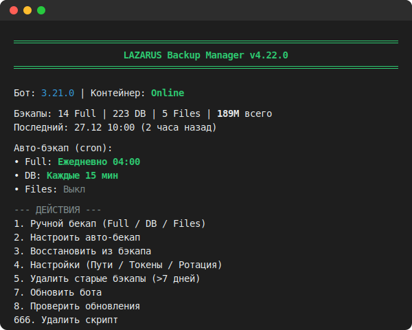
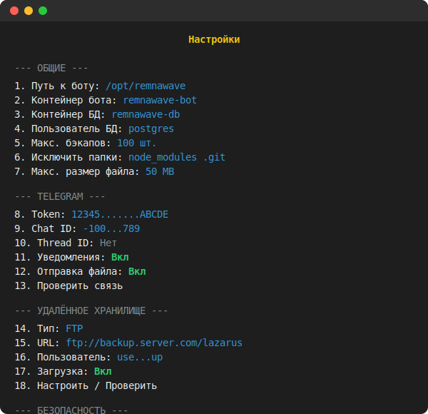
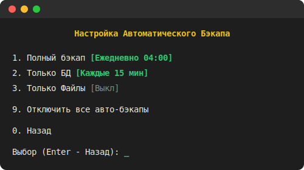
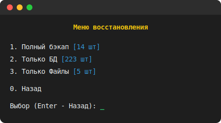
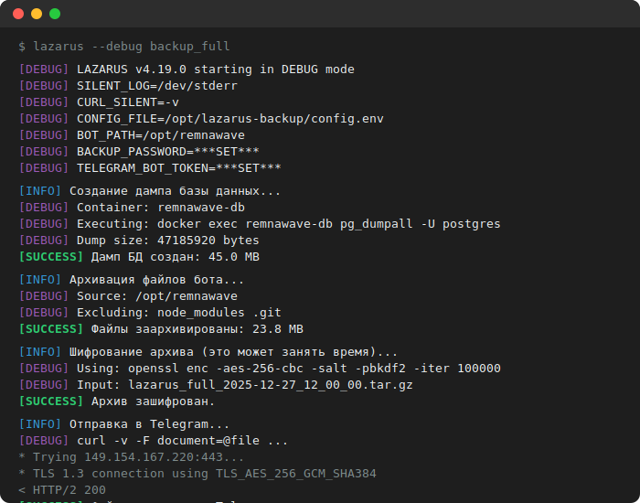
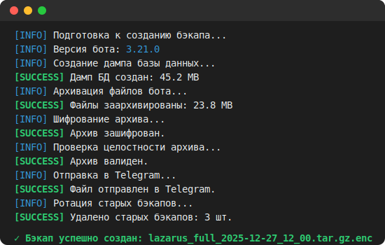
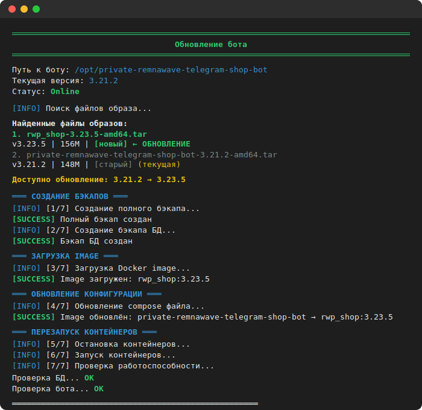

# 📸 LAZARUS Backup Manager — Галерея интерфейса

> Версия скрипта на скриншотах: **4.22.0**

Здесь представлены все основные экраны и режимы работы программы.

---

## 📋 Содержание

| # | Экран | Описание |
|---|-------|----------|
| 1 | [Главное меню](#-главное-меню) | Основной интерфейс программы |
| 2 | [Настройки](#-настройки) | Конфигурация путей, Telegram, хранилища |
| 3 | [Автобэкап](#-автобэкап-cron) | Настройка расписания cron |
| 4 | [Восстановление](#-восстановление) | Меню выбора бэкапа для восстановления |
| 5 | [Debug режим](#-debug-режим) | Расширенный вывод для отладки |
| 6 | [Процесс бэкапа](#-процесс-бэкапа) | Ход выполнения резервного копирования |
| 7 | [Обновление бота](#-обновление-бота) | Процесс обновления бота из tar-файла |

---

## 🏠 Главное меню

Основной экран программы с информацией о:
- Версии бота и статусе контейнера
- Количестве и размере бэкапов
- Настройках автоматического резервирования

---

## ⚙️ Настройки

Полная конфигурация системы:
- **ОБЩИЕ**: пути, контейнеры, лимиты
- **TELEGRAM**: токен, чат, уведомления
- **УДАЛЁННОЕ ХРАНИЛИЩЕ**: FTP/WebDAV/Rclone
- **БЕЗОПАСНОСТЬ**: пароль шифрования (AES-256)

---

## ⏰ Автобэкап (Cron)

Настройка расписания автоматических бэкапов:
- Полный бэкап (БД + файлы)
- Только БД
- Только файлы

---

## ♻️ Восстановление

Выбор типа бэкапа для восстановления с отображением количества доступных файлов каждого типа.

---

## 🐛 Debug режим

Запуск: `lazarus --debug`

Расширенный вывод включает:
- Конфигурационные переменные
- Команды Docker
- Детали шифрования (100k итераций PBKDF2)
- Полный TLS handshake с Telegram API
- Время выполнения

---

## 📦 Процесс бэкапа

Последовательность операций:
1. Создание дампа БД
2. Архивация файлов
3. Шифрование (AES-256-CBC)
4. Проверка целостности
5. Отправка в Telegram
6. Ротация старых бэкапов

---

## � Обновление бота

Безопасное обновление бота из tar-файла:

**Поддерживаемые форматы файлов:**
- `rwp_shop-X.Y.Z-amd64.tar` (новый, рекомендуемый)
- `private-remnawave-telegram-shop-bot-X.Y.Z-amd64.tar` (старый)

**Этапы обновления (7 шагов):**
1. Создание полного бэкапа (БД + файлы)
2. Создание отдельного бэкапа БД
3. Загрузка Docker image из tar
4. Обновление compose файла
5. Остановка контейнеров
6. Запуск контейнеров
7. Проверка работоспособности (БД + бот)

**Защита данных:**
- Двойной бэкап перед обновлением
- Сохранение `compose.pre-update.bak` до успешной проверки
- Инструкции по откату при ошибке

---

## �📝 Примечания

- Все данные на скриншотах — **демонстрационные**
- IP-адреса, токены и пароли заменены на placeholder'ы
- При обновлении версии скрипта обновить:
  - `screenshots/01_main_menu.svg` — версия в заголовке
  - `screenshots/05_debug_mode.svg` — версия в DEBUG output
  - Этот README — версия в шапке

---

*Последнее обновление: 2025-12-30*
