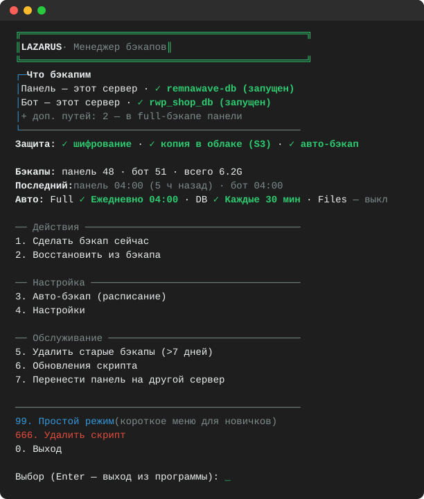
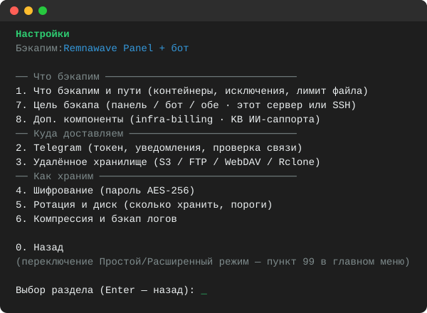
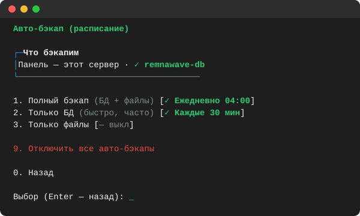
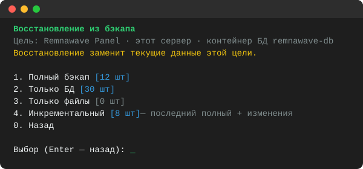
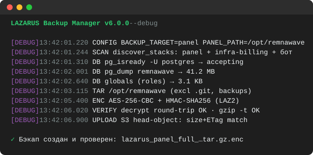
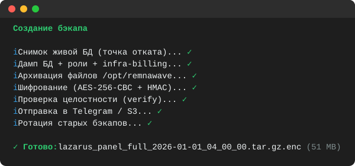
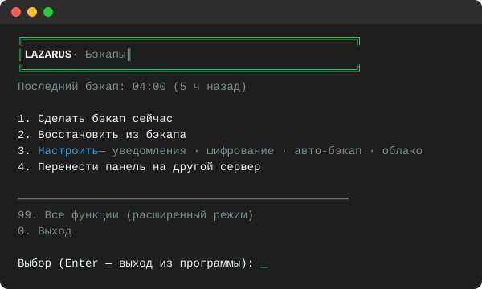

# 📸 LAZARUS Backup Manager — Галерея интерфейса

> Версия скрипта на скриншотах: **6.0.0**

Здесь представлены основные экраны и режимы работы программы.

---

## 📋 Содержание

| # | Экран | Описание |
|---|-------|----------|
| 1 | [Главное меню](#-главное-меню) | Дашборд Расширенного режима |
| 2 | [Настройки](#-настройки) | Конфигурация целей, Telegram, хранилища |
| 3 | [Автобэкап](#-автобэкап-cron) | Настройка расписания cron |
| 4 | [Восстановление](#-восстановление) | Меню выбора бэкапа для восстановления |
| 5 | [Debug режим](#-debug-режим) | Расширенный вывод для отладки |
| 6 | [Процесс бэкапа](#-процесс-бэкапа) | Ход выполнения резервного копирования |
| 7 | [Простой режим](#-простой-режим) | Короткое меню для новичков (4 пункта) |

---

## 🏠 Главное меню

Дашборд Расширенного режима с информацией о:
- Активной цели (панель Remnawave / бот) и её контейнере
- Количестве и размере бэкапов, времени последнего
- Состоянии защиты (шифрование · off-site · авто-бэкап) и расписания

> 💡 В 6.0 есть и **Простой режим** (4 пункта для новичков) — переключается пунктом 99.

---

## ⚙️ Настройки

Конфигурация системы по разделам:
- **Что бэкапим**: цель бэкапа (панель / бот / обе), доп. компоненты (infra-billing · KB)
- **Куда доставляем**: Telegram, удалённое хранилище (S3/FTP/WebDAV/Rclone)
- **Как храним**: шифрование (AES-256), ротация и диск, компрессия

---

## ⏰ Автобэкап (Cron)

Настройка расписания автоматических бэкапов:
- Полный бэкап (БД + файлы)
- Только БД
- Только файлы

---

## ♻️ Восстановление

Выбор типа бэкапа для восстановления с отображением количества доступных файлов каждого типа.

---

## 🐛 Debug режим

Запуск: `lazarus --debug`

Расширенный вывод включает:
- Конфигурационные переменные
- Команды Docker
- Детали шифрования
- Полный TLS handshake с Telegram API
- Время выполнения

---

## 📦 Процесс бэкапа

Последовательность операций:
1. Снимок живой БД (точка отката)
2. Создание дампа БД + сайдкаров (роли, infra-billing, KB)
3. Архивация файлов
4. Шифрование (AES-256-CBC + HMAC)
5. Проверка целостности
6. Отправка в Telegram / удалённое хранилище
7. Ротация старых бэкапов

---

## 🌱 Простой режим

Короткое меню для новичков (переключение — пункт 99):
- 4 пункта: Сделать бэкап · Восстановить · Настроить · Перенести панель
- Пошаговый мастер настройки (уведомления · шифрование · авто-бэкап · облако)

---

## 📝 Примечания

- Все данные на скриншотах — **демонстрационные** (IP-адреса, токены и пароли — placeholder'ы).
- При обновлении версии скрипта обновить:
  - `screenshots/01_main_menu.svg` — версия в заголовке
  - `screenshots/05_debug_mode.svg` — версия в DEBUG output
  - Этот README — версия в шапке
